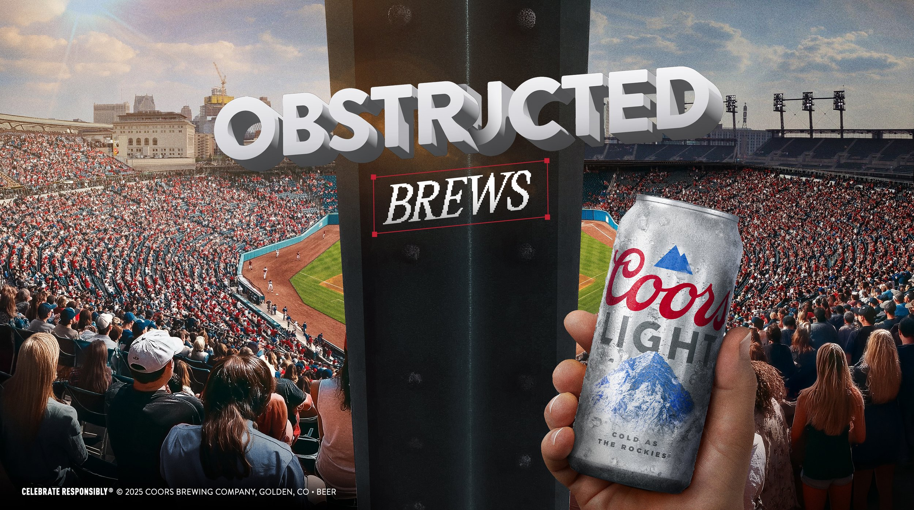

# Images

Drop your image files in this folder using the exact filenames below, then follow
"Swapping in a real image" at the bottom. Every image on the site is currently a
coloured placeholder block showing the filename it expects.

## Filenames the site expects

### Homepage
| File | Where it appears | Recommended size |
|---|---|---|
| `hero.jpg` | Big portrait at the top of the homepage | 1600 × 900 (16:9) |

### Case studies
Each project needs one hero band and up to six gallery shots.

| File pattern | Where | Recommended size |
|---|---|---|
| `<slug>-hero.jpg` | Wide band under the project title | 1800 × 750 (2.4:1) |
| `<slug>-01.jpg` … `-06.jpg` | Gallery grid lower on the page | 1200 × 800 (3:2) |

The slugs are:

```
obstructed-brews      lets-be-real          jbtb-summer
bosch-justaguy        cold-tux              dune-prophecy
essentia-change       black-dont-crack      topochico
accenture-reinvented  chase
```

So Obstructed Brews wants: `obstructed-brews-hero.jpg`, `obstructed-brews-01.jpg`,
`obstructed-brews-02.jpg`, `obstructed-brews-03.jpg`, `obstructed-brews-04.jpg`.

## Swapping in a real image

Find the placeholder in the HTML — it looks like this:

```html
<div class="portrait"><span class="ph">Add your portrait — images/hero.jpg</span></div>
```

Replace the inner `<span>` with an ``:

```html
<div class="portrait"></div>
```

On case study pages the path needs `../` because those files live in `work/`:

```html
<div class="hero-band c-blue"></div>
```

The container handles cropping and aspect ratio, so the image just needs to be
roughly the right shape — it will fill the box without distorting.

## Before you upload

- **Resize.** Nothing needs to be wider than 1800px. A 5MB camera file will make
  the page slow for no visible benefit.
- **Compress.** [Squoosh](https://squoosh.app) is free and runs in the browser —
  aim for under 300KB per image.
- **Use `.jpg` for photos**, `.png` only if you need transparency.

## Getting images out of Squarespace

Do this *before* cancelling — the image URLs stop working when the site goes down.

1. Open each project page on your live site.
2. Right-click each image → "Save image as…"
3. Rename to match the table above.

Squarespace's built-in export (Settings → Import & Export) produces a WordPress
XML file that references images by URL rather than bundling them, so
right-click-saving is more reliable for this.
